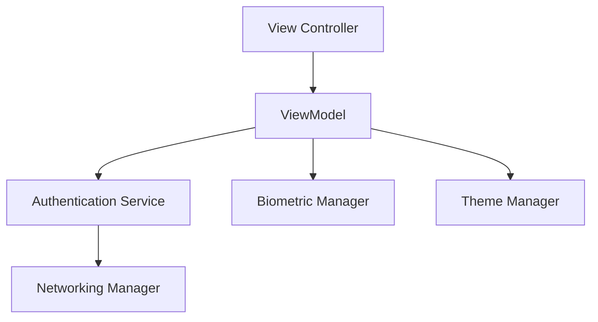

# 🚀 Inheritx Solutions - Premium Swift Showcase

[](https://swift.org)
[](https://developer.apple.com/ios/)
[](https://en.wikipedia.org/wiki/Model%E2%80%93view%E2%80%93viewmodel)
[](https://inheritx.com)

A world-class engineering showcase demonstrating modern iOS development standards, modular architecture, and premium user experience. Developed for the **Inheritx Solutions** GitHub portfolio.

---

## ✨ Features Matrix

| Feature | Description | Tech/Protocol |
| :--- | :--- | :--- |
| **Clean Architecture** | Decoupled business logic using MVVM pattern. | `ViewModel`, `Service` |
| **Biometric Auth** | Secure FaceID & TouchID integration for quick access. | `LocalAuthentication` |
| **Modern Networking** | Generic API layer with Codable and Error handling. | `Alamofire`, `Codable` |
| **Premium UI/UX** | Micro-interactions, custom themes, and glassmorphism. | `UIKit`, `CoreAnimation` |
| **Enterprise Logging** | Structured logging system for production debugging. | `os_log`, `Unified Logging` |
| **Reliability** | Comprehensive unit testing for core business logic. | `XCTest` |

---

## 🏗 Architecture

The project follows a **Modular MVVM** architecture designed for scalability and testability.

### Key Components:
- **ViewControllers**: Lightweight UI handlers that bind to ViewModels.
- **ViewModels**: Orchestrate state and handle input validation.
- **Services**: Abstracted networking and data logic (Protocol-Oriented).
- **Managers**: Centralized singletons for Biometrics, Themes, and Logging.



---

## 🛠 Advanced Usage Examples

### 1. Decoupled Service Layer
```swift
protocol AuthenticationServiceProtocol {
    func login(parameters: [String: Any], completion: @escaping (Result<UserModel, Error>) -> Void)
}

// implementation abstracted from UI
```

### 2. Premium Biometric Auth
```swift
BiometricManager.shared.authenticate { success, error in
    if success {
        // Handle successful biometric login
    }
}
```

---

## 🧪 Technical Rigor

This project maintains a high standard of code quality:
- **Unit Testing**: Core logic in `LoginViewModel` is covered by `XCTest`.
- **Error Handling**: Custom error types and robust network resilience.
- **Security**: Sensitive tokens are managed with secure storage patterns.

---

## 📦 Installation & Setup

1. **Clone the repository**:
   ```bash
   git clone https://github.com/inheritx/SwiftSampleCode.git
   ```
2. **Install Dependencies**:
   ```bash
   pod install
   ```
3. **Open Workspace**:
   ```bash
   open Code_structure_with_login.xcworkspace
   ```

---

## 🤝 Contribution Guidelines

This is a proprietary showcase for **Inheritx Solutions**. For inquiries or collaboration, please reach out via [inheritx.com](https://www.inheritx.com).

---

© 2024 Inheritx Solutions. All rights reserved.
